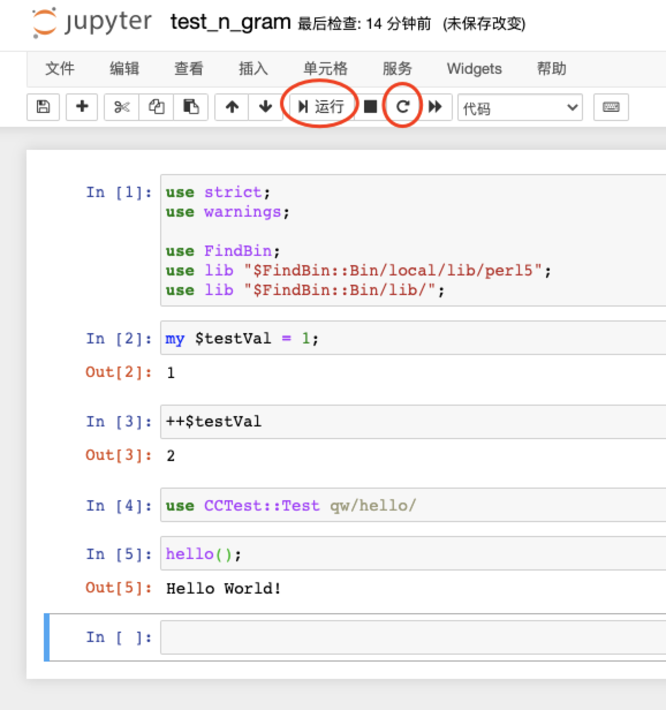
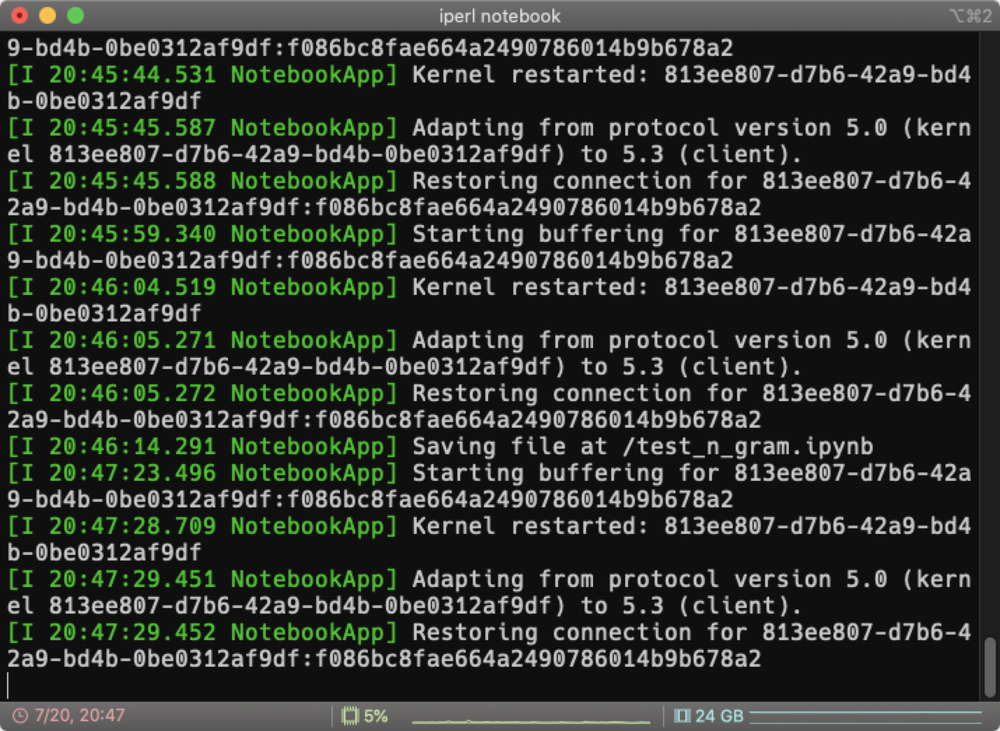

之前我们解决了[Perl项目管理](https://tannineo.github.io/2020-07-17/perl-project/).

我们接下来尝试为`perl`环境搭建`Jupyter`, 在`Notebook`中进行交互式的编程提高~~科研~~效率.

<!-- more -->

- [遗留问题: `perlbrew`下的`cpanm`](#遗留问题-perlbrew下的cpanm)
- [Perl Notebook 环境](#perl-notebook-环境)
  - [安装`ZeroMQ`](#安装zeromq)
  - [安装`Jupyter`](#安装jupyter)
  - [安装`Devel::IPerl`](#安装develiperl)
- [试用](#试用)
- [总结](#总结)

注意, 所有操作基于OSX, 但是查看参考链接能发现Windows或者Linux的对应方案.

## 遗留问题: `perlbrew`下的`cpanm`

[`cpanm`](https://metacpan.org/pod/cpanm)在一般情况下都会被其他依赖的作者作为`perl`自带`cpan`的替代品, 用来安装依赖. 它输出更简洁, 本身体积和运行花销也不大.

`perlbrew`的作者的文章[Perlbrew and Friends](https://perlbrew.pl/Perlbrew-and-Friends.html)提到了`cpanm`的安装. 基本问题就是: `cpanm`并不是作为`perl`官方工具链的一部分, 需要自己手动安装, 而每次切换`perl`版本会将`cpanm`从`PATH`中移除.

在当前环境下安装`cpanm`, 我们可以输入:

```shell
perlbrew install-cpanm
```

## Perl Notebook 环境

我们接下来的操作都基于[Devel::IPerl](https://github.com/EntropyOrg/p5-Devel-IPerl)的README.

但是在执行的过程中, 我们需要搞清楚对于每个组件, 对于相应的语言, 我们会基于何种形式安装:

- `python`相关的组件会被安装在沙箱环境中(本肥肥使用`pipenv`): `jupyter`
- `perl`的通用依赖安装于对应的`perl`版本中(如`cpanm`): `ZMQ::LibZMQ3` & `Devel::IPerl`
  - 项目依赖安装在`perl_version@project_name`的沙箱环境中
- 其余组件安装在系统环境中, 比如数据库或者消息队列: `ZeroMQ`

### 安装`ZeroMQ`

OSX省心...

```shell
brew install zmq
```

接下来安装`perl`操作`ZeroMQ`的依赖:

```shell
export ARCHFLAGS='-arch x86_64'
cpanm --build-args 'OTHERLDFLAGS=' ZMQ::LibZMQ3
```

### 安装`Jupyter`

在工程目录下于终端输入:

```shell
pipenv shell
```

进入`pipenv`沙箱, 并生成一个`./Pipfile`文件. 我们在这个沙箱中安装`jupyter`:

```shell
pipenv install jupyter --skip-lock
```

`pipenv`的生成快照的速度相当之慢, 所以没有特殊需求的话, 安装dependency时可以使用`--skip-lock`跳过locking.

如果直接使用`pip`安装依赖, 这个沙箱环境中也会有依赖, 但是不会被记录在`./Pipfile`文件里.

### 安装`Devel::IPerl`

```shell
cpanm Devel::IPerl
```

这会经历一段漫长的编译和测试过程. 在文章撰写之日, 本肥肥发现安装会无法通过.

`Devel::IPerl`作者的解决方案是手动安装特定版本的依赖:

```shell
cpanm Markdent@0.26 Markdown::Pod@0.006
```

之后重新安装`Devel::IPerl`, 可能需要force install:

```shell
cpanm Devel::IPerl --force
```

## 试用

在环境下输入:

```shell
iperl notebook
```

我们就会打开熟悉的`jupyter`编辑器页面. 新建notebook时选择"IPerl 0.009".

使用过程中只有`运行下一步`和`重启kernel`的功能是完全正常的(这个项目最后一次更新是2018年...). 大家在试用的时候可以注意`jupyter`的输出日志.





但这些也足够满足我们的需求了, 我们能够执行基本的`perl`交互式编程了!

引入我们在上一篇文章中安装的`./local/`和自己的`./lib`也没问题!

## 总结

- 理清我们所有组件的安装环境/位置.
  - 可以的话写个README记录一下.
- 参考`Devel::IPerl`的`RAEDME.md`安装:
  - `ZeroMQ`
  - `jupyter`
  - `Devel::IPerl`(可能会出错, 详读README)
- `iperl notebook`打开`jupyter`.
  - bug多多, 但是能用

---

对, 没错, 我就是靠别人的`README.md`水了一篇博客!
